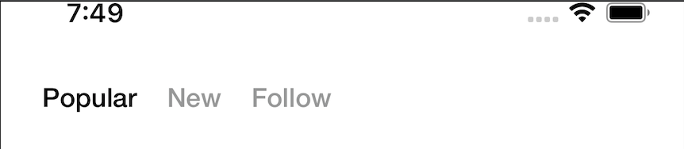
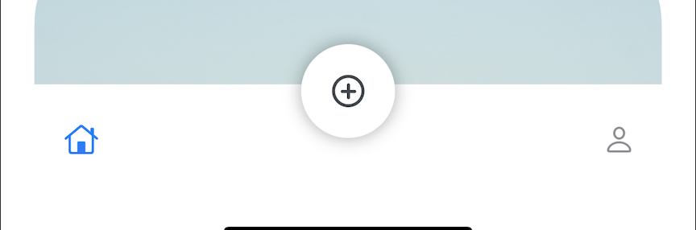
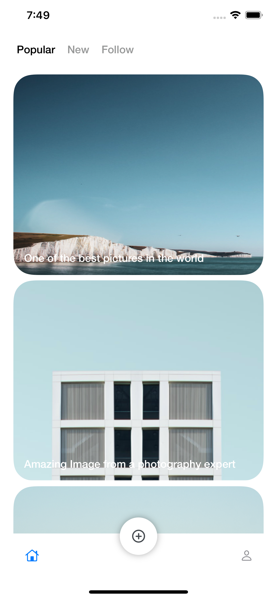
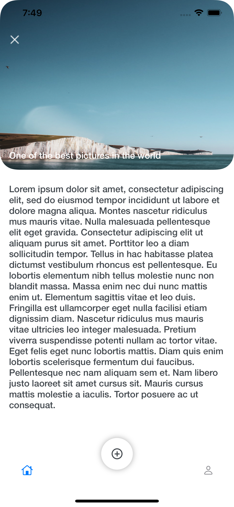
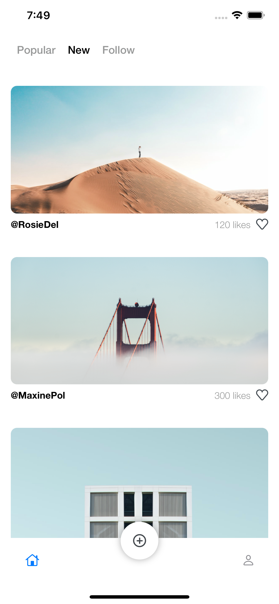
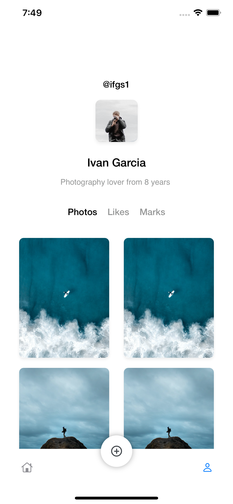

# Social Network iOS App
A Social network built using swiftUI

## Description
This App shows is a social network built using SwiftUI, it includes 5 different screens (popular posts screen,  new posts screen, followed posts screen ,profile screen, and post detail screen).

## Animations

### Detail Animation

Inside the Main screen, once you cap one of the cards, you can see an amazing go to detail animation built using the GeometryReader and  swiftUI animations. Once you tap the card, you can see that the animations zooms to the detail according to the card that you just tapped.

### Swipe animation

When tapping on the + icon from the custom tab bar, the swipable view will display, You will be able to see the different cards with an image and description and you can swipe them with a nice animation.

## Custom Views

### Custom Segmented Control

The project includes a custom segmented control built from scratch using swift UI. For using it it's really symple, you just need to specify an array of the different options you want to display and handle the actions according to each one.

### Custom TabBar

In addition, I also created a Custom Tab bar with a specific design with a cool + icon that is outside the Tab Bar.

## Dark Mode
The application provides full support for dark mode, you can use it in regular mode or dark mode.

## Screens
### PostList

### PostDetail

### NewPosts

### Profile

### Complete interaction

## License
©Iván Felipe García Sánchez
